# Bare Minimal Linux Kernel & RootFS


OS: Ubuntu 20.04 LTS

Linux Kernel: Version-6.5.7

BusyBox: Version-1.36.1

# Creating Linux Kernel

### Download 
```sh 
$ wget https://cdn.kernel.org/pub/linux/kernel/v6.x/linux-6.5.7.tar.xz
$ tar -xvf linux-6.5.7.tar.xz
$ cd linux-6.5.7
```

### Configure tiniest possible kernel 
```bash  
$ make allnoconfig
```
This will create .config file setting values to 'n' as much as possible.

### Customization
```bash
$ make menuconfig 
```
This will open a window with many Linux kernel configuration settings. You can enable or disable those settings and customize the Linux kernel as needed.

Tips: use left, right, up and down arrow key to navigate 

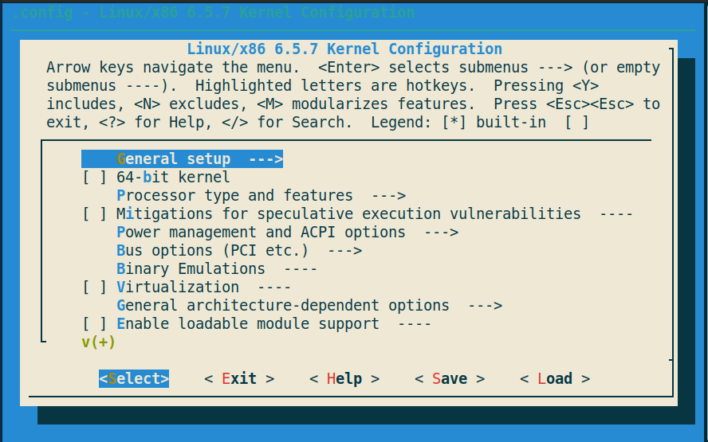
<br/>
<br/>
Now set following options-

## Option 1: Enable 64 bit support 
Enable 64 support 

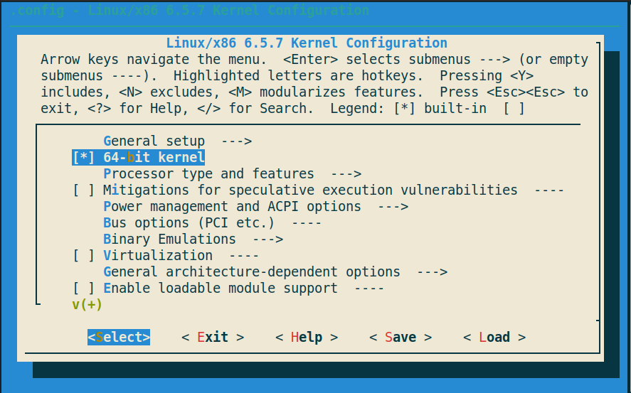

## Option 2: Hostname
`General setup >> Default hostname`
Set a Host name `Embedded_linux`

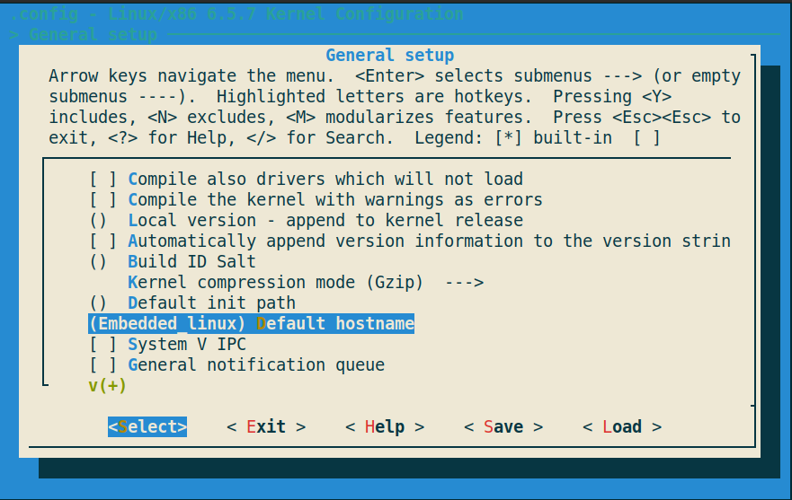

## Option 3: Enable support for RAM disk

General Setup >> Initial RAM filesystem and RAM disk (initramfs/initrd) support

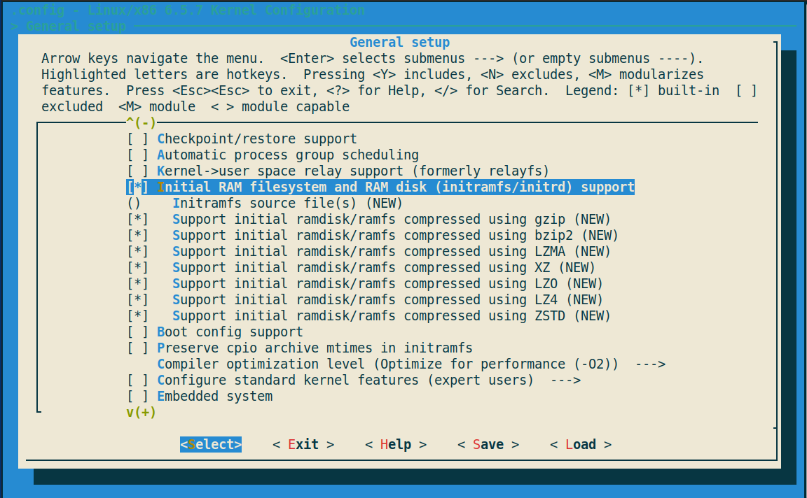

## Option 4: Configure standard kernel features

General Setup > Configure standard kernel features (expert users)

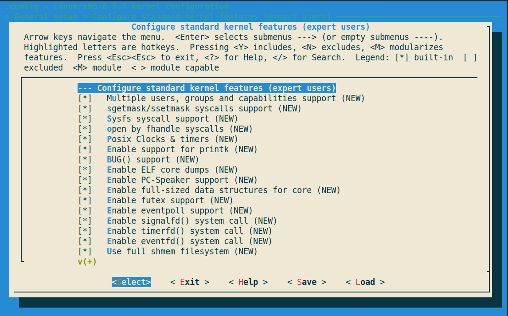
 

## Option 5: Ensure Gzip Kernel compression

General Setup >kernel compression mode (Gzip)

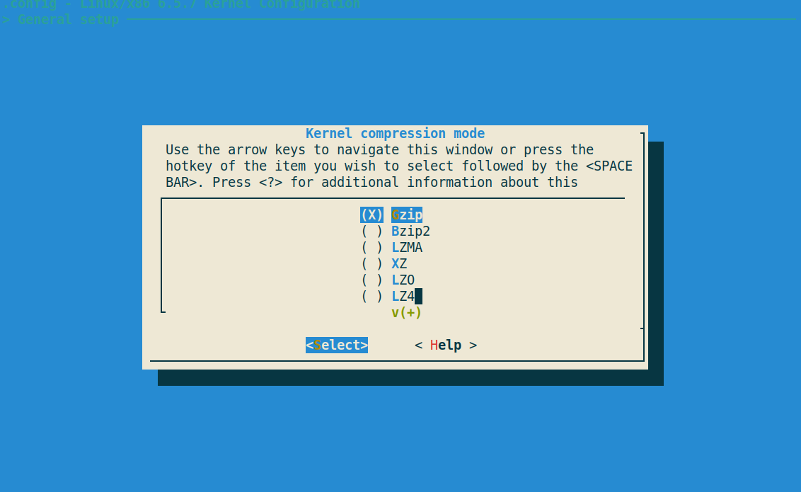


## Option 6: ELF binary and script

Executable file formats > Kernel support for ELF binaries
Executable file formats > Kernel support for scripts starting with #!

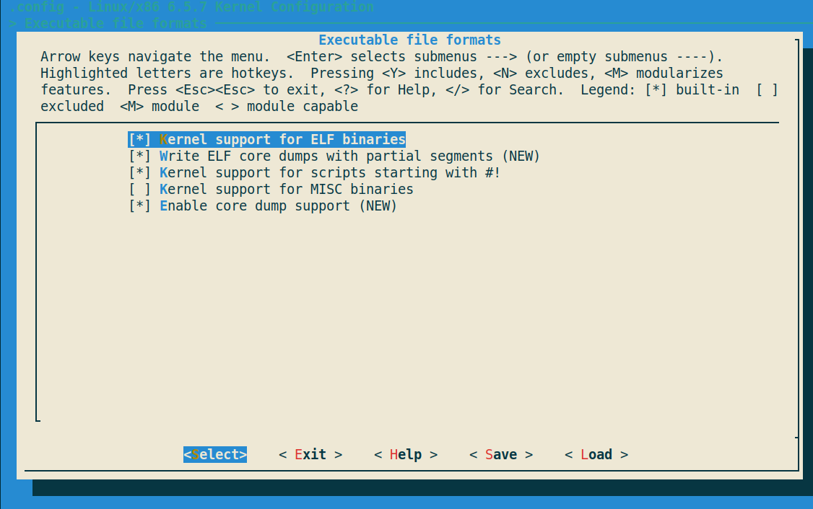

## Option 7: Enable devtmpfs

Device Driver > Generic Driver Options > Maintain a devtmpfs filesystem to mount at /dev

Device Driver > Generic Driver Options > Automount devtmpfs at /dev, after the kernel mounted the rootfs

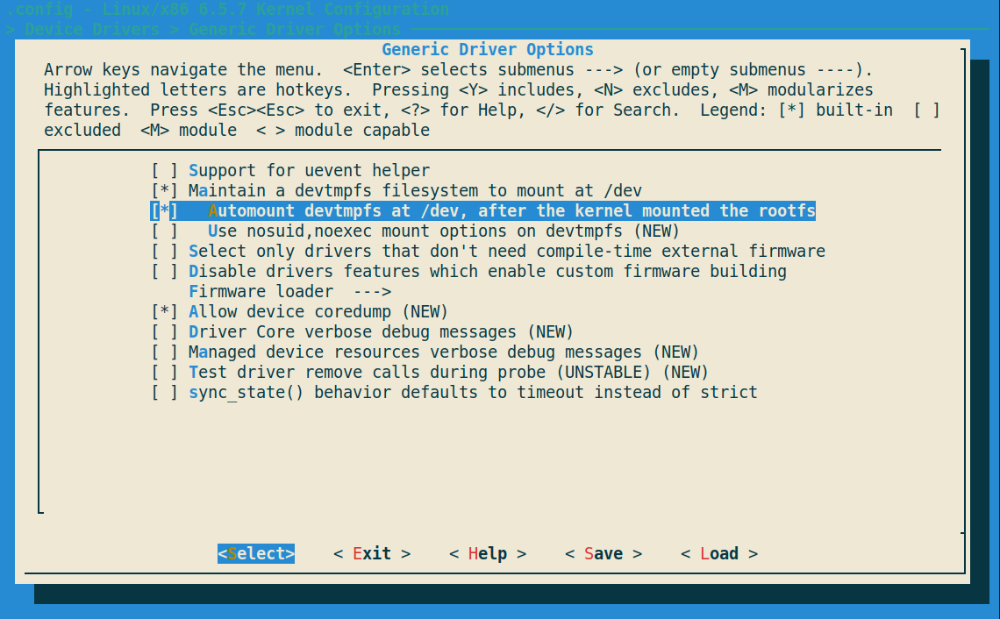 

## Option 8: Enable TTY

Device Driver > Character devices > Enable TTY

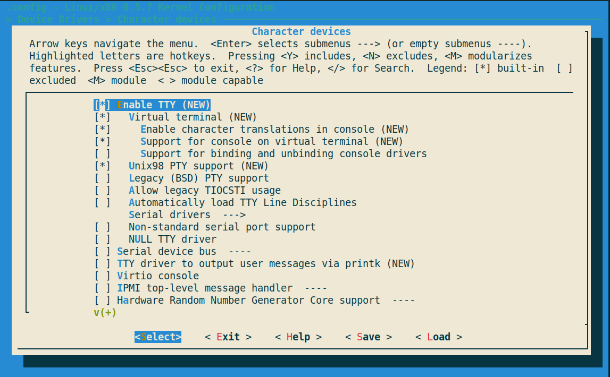 

## Option 9: Enable Serial Drivers

Device Driver > Character devices > Serial Drivers  > 8250/16550 and compatible serial support

Device Driver > Character devices > Serial Drivers  > Console on 8250/16550 and compatible serial port

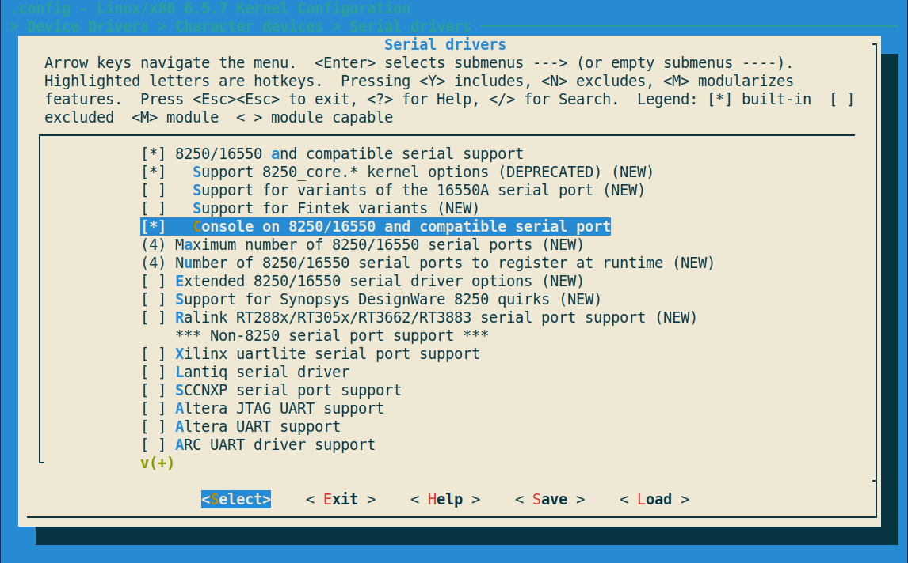 

## Option 10: Pseudo filesystems

File systems > Pseudo filesystems > /proc file system support
File systems > Pseudo filesystems > /sysfs file system support

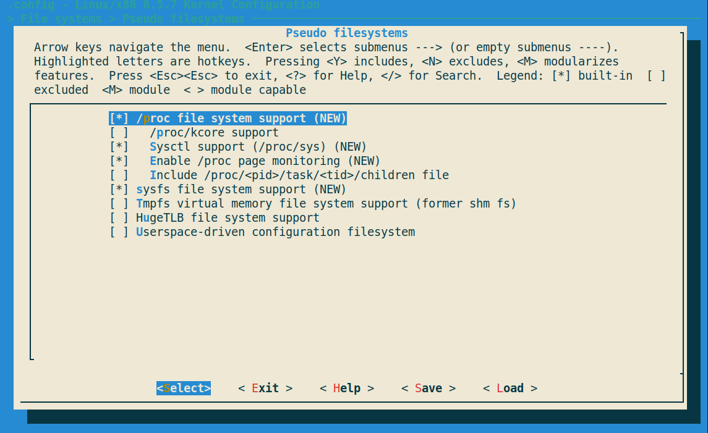 
<br/>
<br/>

Now, save and close the configuration window.

## Building Linux Kernel

Here is the build command to build Linux kernel.

```bash
$ make -j4
``` 
Here `make -j <number of cpu>`, it will take 1.28min for me.

To see how many CPU Core or How mane processor you have type:
```
$ nproc
```
<video controls autoplay loop muted width="400" height="600">
  <source src="videos/kernel.mp4" type="video/mp4">
  Your browser does not support the video tag.
</video>

Your Linux kernel is now ready and can be found in the `linux-6.5.7/arch/x86/boot` directory.

```sh
$ cd linux-6.5.7/arch/x86/boot
$ ls -sh bzImage
```
Linux Kernel Size: 1.7MB

Create a working Directory and put the linux kernel image 
```sh
$ mkdir -p ~/workspace_kernel/linux-kernel
$ cp linux-6.5.7/arch/x86/boot/bzImage ~/workspace_kernel/linux-kernel
```

# Creating Initramfs 

Downloading latest Busybox
```bash
$ wget https://busybox.net/downloads/busybox-1.36.0.tar.bz2
```
cd to workspace directory
```sh 
$ cd ~/workspace_kernel
```

extracting the Busybox source tree
```sh
$ tar -xvf busybox-1.36.0.tar.bz2
```
Cd to busybox
```sh
$ cd busybox-1.33.1
```
Customize busybox 
```
$ make menuconfig
```

This will start configuration menu for BusyBox. We need only one setting. 

Settings > Build static binary (no shared libs)

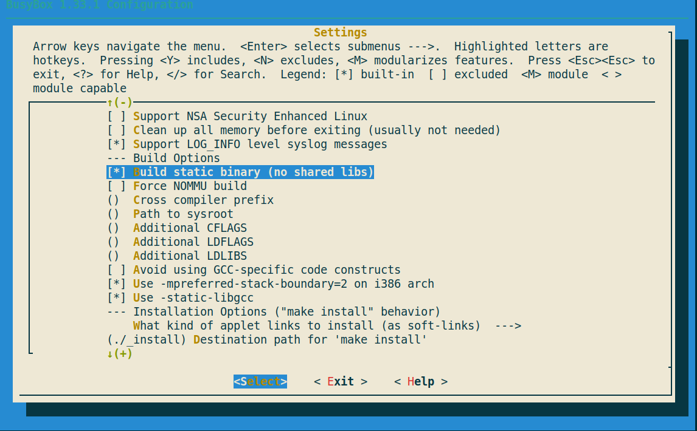 
<br/>
<br/>

Now, exit and save.

It is time to build busybox.

Build
```sh 
$ make -j4
$ make -j <number of CPU core>
```
To see how many CPU Core or How mane processor you have type:
```
$ nproc
```

More general command
```
$ make -j ${nproc}
```

Install  
```sh
$ make install
```
This will install binaries in “./_install” directory

```sh
# another command to install busybox in user specific directory
$ make CONFIG_PREFIX=$PWD/woris install
```

## Create The RAM DISK Image

Cd to workspace directory
```sh 
$  cd ~/workspace_kernel
```
creating embedded_linux directory and cd to embedded_linux

```sh
$ mkdir embedded_linux && cd embedded_linux
```
Now Craete `etc`, `proc`, `sys` and `dev` directory.
```sh 
$  mkdir -p etc proc sys dev
```

Coping all busybox installed files to `~/workspace_linux/embedded_linux`
```sh
$  cp -a <busybox install dir>/_install/* .
```


Create init script in “embedded_linux” directory.
This is the content of init script.
```sh
$ cd ~/workspace_kernel/embedded_linux
$ vim init
```
``` sh
#!/bin/sh
mount -t proc none /proc
mount -t sysfs none /sys
cat <<!
boot took $(cut -d' ' -f1 /proc/uptime) seconds
Welcome to EmbeddedCraft Mini Linux for Learners !!!
!
exec /bin/sh
```

It is time to make init file executable. Give executable permission to init file
```sh
$  chmod +x init
```

Creating initramfs as cpio archieve
```sh
$ find . -print0 | cpio --null -ov --format=newc | gzip -9 > initramfs.cpio.gz
```

Now the Directory structure look like 
```
.
├── bin
├── dev
├── etc
├── init
├── initramfs.cpio.gz
├── linuxrc -> bin/busybox
├── proc
├── sbin
├── sys
└── usr

7 directories, 3 files
```

# Booting Linux in QEMU

it is time to start QEMU and booting our mini Linux.
```
$ qemu-system-x86_64 \
-kernel <linux kernel dir>/arch/x86_64/boot/bzImage \
-initrd <busybox dir>/embedded_linux/initramfs.cpio.gz \
-append "init=/bin/sh console=ttyS0"  -nographic -no-reboot
```

if you download the zip archive so the command look like

```sh
$ qemu-system-x86_64 \
-kernel linux_kernel/bzImage -initrd embedded_linux/initramfs.cpio.gz \
-append "init=/bin/sh console=ttyS0" -nographic
```

# You Successfully build a custom linux kernel & RootFS 

<br/>
<br/>

Here some Command you may try

```sh
$ uname -a
$ cat /proc/cpuinfo
$ top
$ ls
$ cd
$ mkdir
$ grep
$ find

# typelinux commands
```
To kill qemu open a new terminal and type
```sh 
$ killall qemu-system-x86_64
```

## Project Screen Shots:

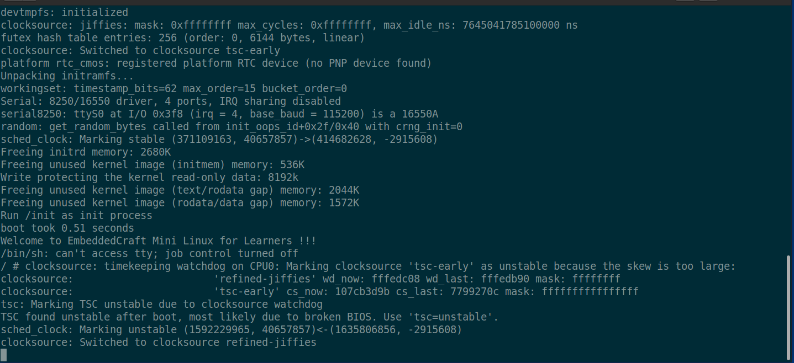
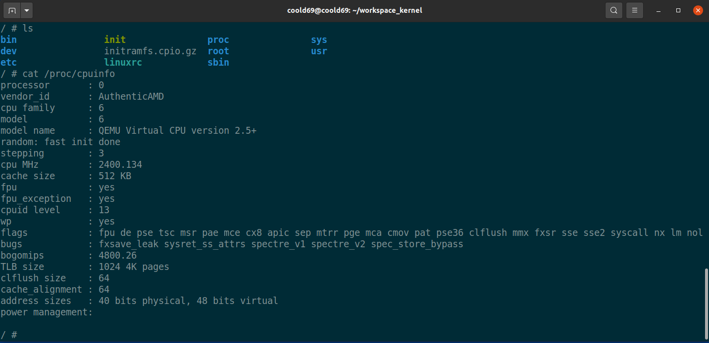
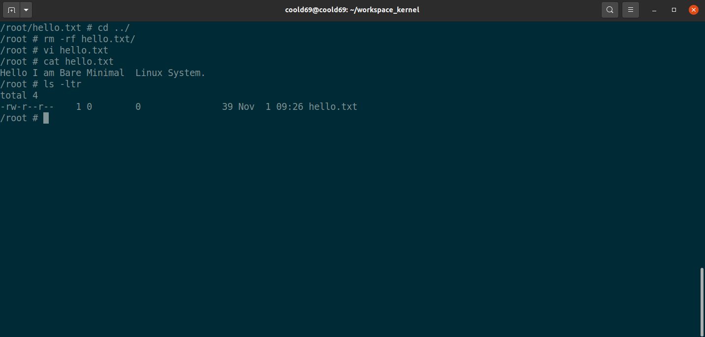


## Reference:
- [Mastering Embedded Linux Programming - Second Edition.pdf](http://centaur.sch.bme.hu/~holcsik_t/upload/Mastering%20Embedded%20Linux%20Programming%20-%20Second%20Edition.pdf)

- [Tutorial: Building the Simplest Possible Linux System - Rob Landley, se-instruments.com](https://youtu.be/Sk9TatW9ino?si=d300B9ARC82QXXKG)

- [landlay.net](https://landley.net/aboriginal/about.html)

- [https://www.kernel.org/](https://www.kernel.org/)